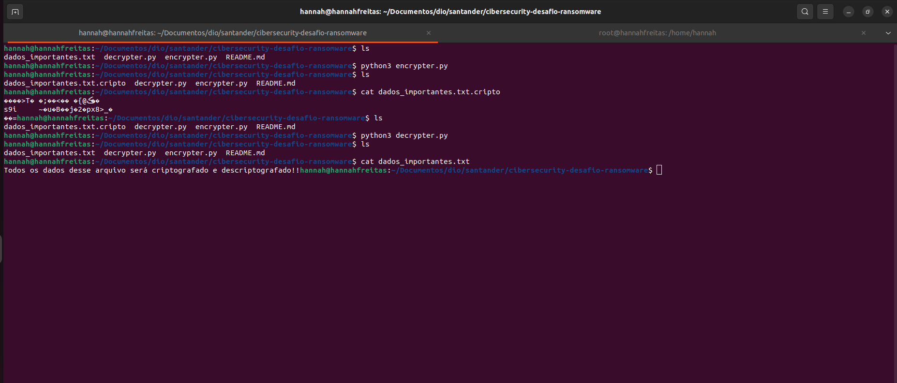

# Desafio Ransoware

### Criação de um ransomware para criptografar dados e descriptografar esses mesmos dados.

* #### Métodos utilizadas:

1. Python para criação do script
2. Utilização do dotenv para criptografar a senha utilizada no script
3. Implementação do AES (Advanced Encryption Standard)

